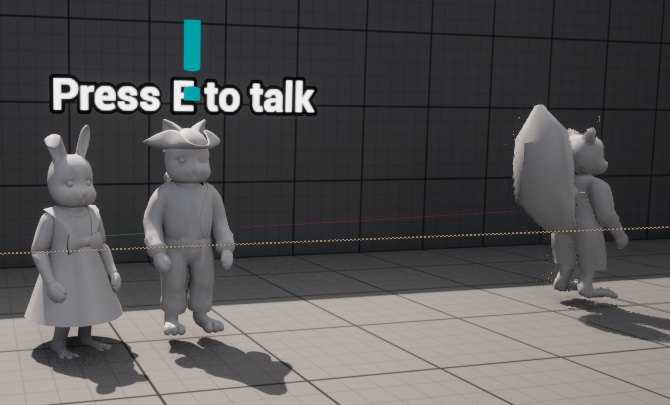

[<button>Home</button>](./)
&nbsp;&nbsp;[<button>Portfolio</button>](./portfolio.html)
&nbsp;&nbsp;[<button>Contact</button>](./Contacts.html)&nbsp;&nbsp;

## This is Dollhouse

The Dollhouse is a game that I am currently working on with my Development team at University. Dollhouse is s horror game based in a dollhouse in which the player hyas the role of a cute toy creature running away from a big scary Action Figure that is an AI run enemy that hunts the player nonstop as long as they are within eyesight of the action figure.

I have mainly worked on the stun mechanics and brakable objects within the game which consist of the player being able to pick up objects and or friends and throw them at the enemy chasing the player through the house to stun them for a short time to give the player a chance to get away and escape. The stun works by Disabling the Enemy AI's Movment once an object with stunning properties such as a lamp or a furry friend has collided with the AI to hit it and subsequently stop it from moving for a very short while.

The Destructible objects that I am working to create now is done through the chaos engine in Unreal which I am working to make objects only destructible under certain conditions.

The destructible objects now break on contact with the Sarge AI and decay when pieces break off of the main cluster.

I created a secondary stun mechanic where the AI can be stunned if the player has picked up a certain LED light pick-up to stop the Sarge AI if he has grabbed the player allowing them to escape the AI

