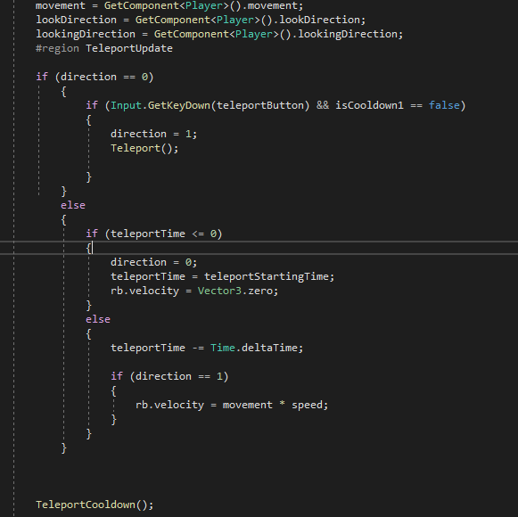
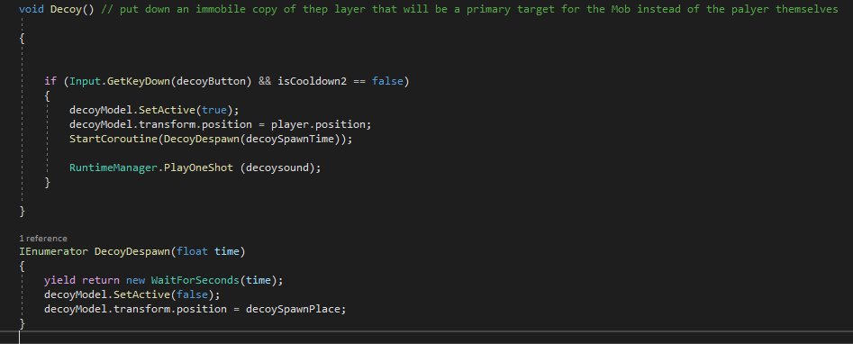
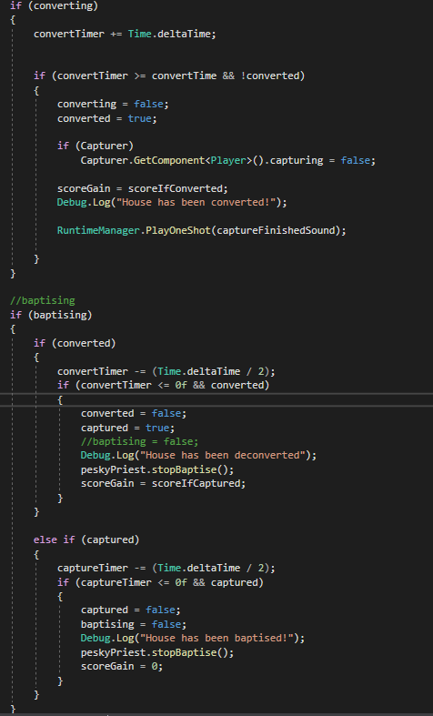

[Home](./)&nbsp;&nbsp;[Portfolio](./portfolio.html)&nbsp;&nbsp;[Contacts](./Contacts.html)&nbsp;&nbsp;[CV](./CV.html)

## This is Dromos

<iframe width="500" height="281" src="//www.youtube.com/embed/hVF-8pwqSuU" frameborder="0" allowfullscreen=""></iframe>

Here is the [DROMOS Itch](https://rchi.itch.io/dromos)

#### the concept of the game:

As an avid, but naïve practitioner of the dark arts, you seem to have bitten off more than you can chew, by accidentally summoning an ancient entity, Vual. Under the promise of unimaginable power and knowledge, you have been tasked with spreading the Gospel of Vual and his teachings to recruit members for His cult.

 Nothing spreads faster than word of mouth, and the town you reside in, Dromos, is the perfect breeding ground for corruption since the residents thrive in misery and despair. 

Go door to door and convert the townsfolk to your cult. Conversion is displayed as bars above the capturable households. Meanwhile, look out for priests who patrol the streets, informing the residents about your true intentions whilst avoiding the angry mobs that will hunt you down and kill you. To counter your enemies, activate your abilities bestowed upon you by Vaul and conquer Dromos.

I created a short dash for the character that allows the player to do a leap forward giving them a bit more maneuverability to both traverse the map and environment but to also give the player a slight advantage if managed correctly to evade and escape the Angry Mob while converting houses to your cult. 

I also created a Decoy ability that spawns an innactive copy of the player which can both repel the priest from an area and distract the Mob at the same time giving the player even more time and opportunity to convert the townsfolk to the cult of Vaul.

This is the Script I made for the conversion of the houses in the town of Dromos as the player was able to walk up to said house and begin to convert it to the cult of Vaul by talking to the townsfolk and convincing them to join the cult. The Houses can also be baptized by the priest which is why the player has the ability to chase the priest away to stop them from baptizing the house.