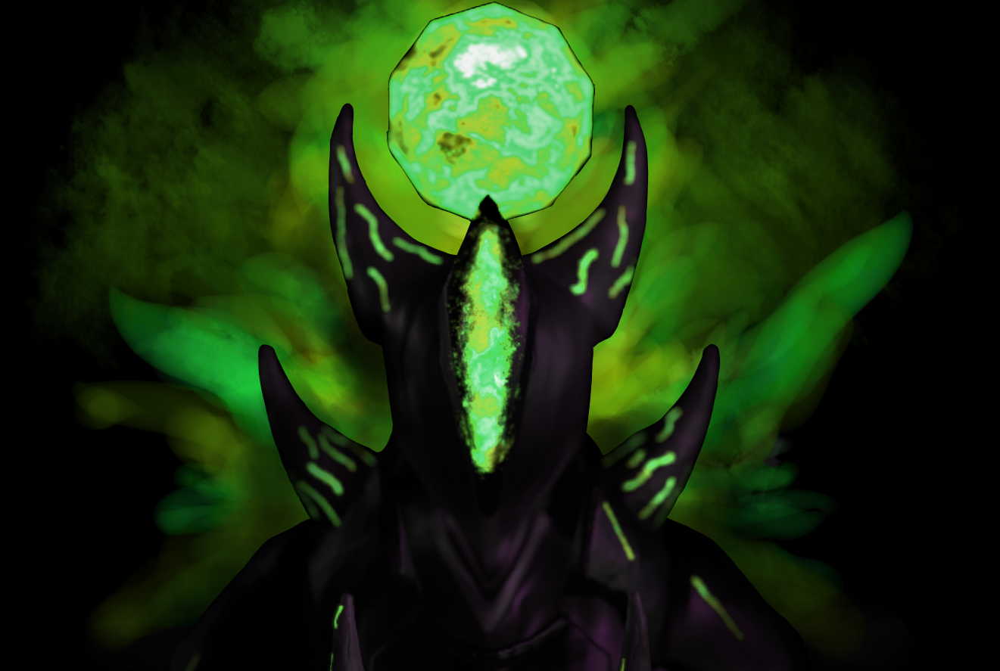
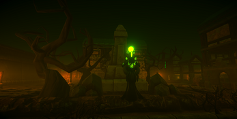

[Home](./)&nbsp;&nbsp;[Portfolio](./portfolio.html)&nbsp;&nbsp;[Contacts](./Contacts.html)&nbsp;&nbsp;[CV](./CV.html)

## This is Dromos

<iframe width="500" height="281" src="//www.youtube.com/embed/hVF-8pwqSuU" frameborder="0" allowfullscreen=""></iframe>

#### the concept of the game:

As an avid, but naïve practitioner of the dark arts, you seem to have bitten off more than you can chew, by accidentally summoning an ancient entity, Vual. Under the promise of unimaginable power and knowledge, you have been tasked with spreading the Gospel of Vual and his teachings to recruit members for His cult.

 Nothing spreads faster than word of mouth, and the town you reside in, Dromos, is the perfect breeding ground for corruption since the residents thrive in misery and despair. 

Go door to door and convert the townsfolk to your cult. Conversion is displayed as bars above the capturable households. Meanwhile, look out for priests who patrol the streets, informing the residents about your true intentions whilst avoiding the angry mobs that will hunt you down and kill you. To counter your enemies, activate your abilities bestowed upon you by Vaul and conquer Dromos.